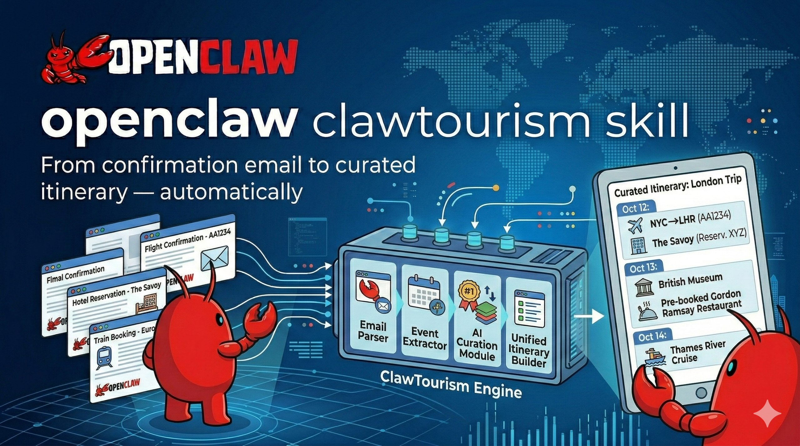

<p align="center">
  
</p>

<h1 align="center">🧳 ClawTourism</h1>
<h3 align="center">From Confirmation Email to Curated Itinerary — Automatically</h3>

<p align="center">
  ClawTourism scans your Gmail travel bookings, builds structured trip files,<br/>
  and delivers proactive intelligence: flight alerts, pre-trip checklists, day plans,<br/>
  visa checks, transfer suggestions, and restaurant release-day alerts.<br/>
  <strong>Set it up once. It watches your trips so you don't have to.</strong>
</p>

<div align="center">

[](LICENSE)
[](https://github.com/yhyatt/ClawTourism)
[](https://clawhub.ai/skills/clawtourism)
[](https://github.com/yhyatt/ClawTourism)

</div>

<p align="center">
  <a href="#-openclaw-friendly">OpenClaw 🦞</a> •
  <a href="#-features">Features</a> •
  <a href="#-quick-start">Quick Start</a> •
  <a href="#-how-it-works">How It Works</a> •
  <a href="#-proactive-alerts">Proactive Alerts</a> •
  <a href="#-architecture">Architecture</a> •
  <a href="#-extending">Extending</a>
</p>

---

## 🦞 OpenClaw Friendly

ClawTourism is designed to be set up and operated entirely by an AI agent. Install the skill from [ClaWHub](https://clawhub.ai/skills/clawtourism), then just say:

> *"Scan my Gmail for travel bookings and set up my upcoming trips."*

Your agent will parse all `label:Trips` emails, extract flights/hotels/restaurants/cruises, detect gaps, and set up flight monitoring and pre-trip checklists — all automatically.

**Works seamlessly with:**
- 🎉 [ClawEvents](https://clawhub.ai/skills/clawevents) — event discovery for your destination
- 🍽️ [ClawCierge](https://clawhub.ai/skills/clawcierge) — restaurant booking
- 💸 [ClawBack](https://clawhub.ai/skills/clawback) — group expense splitting
- 👥 Group Agent — trip data shared with group WhatsApp agent (read-only)

---

## ✨ Features

<table>
<tr>
<td width="50%">

### 📧 Email Intelligence
- **Label-first scanning** — reads only `label:Trips`, zero false positives
- **Forwarded email traversal** — handles family members forwarding bookings
- **PDF parsing** — boarding passes, cruise vouchers, hotel confirmations
- **RTL Hebrew support** — Israeli travel agents, El Al, Hebrew booking refs
- **Clarification loop** — ambiguous emails → `unassigned.jsonl` for human review

</td>
<td width="50%">

### 🗂️ Trip Assembly
- **Unified Trip model** — flights, hotels, restaurants, cruises in one structured file
- **Gap detector** — missing return flight? No hotel? Cruise check-in not done?
- **Cross-group trips** — trip JSON files shared across group agents
- **Markdown + JSON output** — human-readable summaries + machine-readable data

</td>
</tr>
<tr>
<td width="50%">

### ✈️ Flight Intelligence
- **D-1 alert** — terminal, seat, check-in window, departure time
- **Day-of monitoring** — gate assigned, delays >15min, boarding, cancellations
- **AeroDataBox** — free tier (100 calls/mo), covers all major airlines

</td>
<td width="50%">

### 🗓️ Day Planner
- **Every trip day** — morning / afternoon / evening activity suggestions
- **Cruise port days** — same engine, with back-on-ship time constraint
- **Personalized** — family filter (kids-friendly), group member preferences
- **Powered by ClawEvents** for supported cities (TLV, BCN, NYC)

</td>
</tr>
<tr>
<td width="50%">

### 🧳 Pre-Trip Intelligence
- **D-14/7/3/1 checklists** — passport check, packing, prescriptions, final
- **Packing list generator** — weather-aware (Open-Meteo), kids-aware, trip-type aware
- **Weather forecast** — D-3/D-1 real forecast at destination (Open-Meteo, free)
- **Visa check** — Israeli passport requirements lookup by destination

</td>
<td width="50%">

### 🚕 Logistics
- **Transfer suggestions** — airport/pier → hotel when both are known
- **Restaurant release-day alerts** — Resy 28-day, OpenTable 30-day rules
- **Currency prep** — ILS→destination FX rate D-7 (frankfurter.app, free)
- **All opt-out** — each group member controls their own notification preferences

</td>
</tr>
</table>

---

## 🚀 Quick Start

```bash
pip install clawtourism
```

```bash
# Label travel emails in Gmail with "Trips", then:
export GOG_KEYRING_PASSWORD="your-gog-keyring-password"

# Scan and build trip files
python -m clawtourism scan

# View trip summary
python -m clawtourism show msc-cruise-mar-2026

# Check gaps
python -m clawtourism gaps

# Set up flight monitoring crons
python -m clawtourism monitor

# Set up pre-trip checklists
python -m clawtourism checklists
```

---

## ⚙️ How It Works

```
Gmail (label:Trips)
        ↓
   scanner.py          reads label:Trips via gog CLI
        ↓
   extractor.py        regex-based booking extraction
   pdf_extractor.py    PDF tickets, vouchers, confirmations
        ↓
   assembler.py        groups emails → Trip objects
        ↓
memory/trips/{slug}.json    ← cross-group readable
memory/trips/{slug}.md      ← human readable
        ↓
   gap_detector.py     missing flights, hotels, docs, kids
   renderer.py         markdown summary
        ↓
   pre_trip.py     → D-14/7/3/1 crons → OpenClaw cron API
   flight_monitor.py → D-1 + day-of crons
   resy_alerts.py  → release-day crons
```

---

## 🔔 Proactive Alerts

### Pre-Trip Timeline

| When | Alert |
|------|-------|
| **D-14** | Passport check, insurance, restaurant gaps, "want a packing list?" |
| **D-7** | Packing list (weather + kids aware), prescriptions, currency rate |
| **D-3** | Docs offline, luggage weight, car to airport, weather forecast |
| **D-1** | Final checklist, flight details, "I'll track gate + status tomorrow" |
| **Day-of** | Gate assigned, delays, boarding — every 45 min until departure |

### Restaurant Release-Day Alerts (e.g. NYC)

```
🍽️ Don Angie opens reservations TOMORROW at midnight ET.
   Open Resy now → resy.com/cities/nyc/don-angie

🚨 NOW — Lilia just opened for Jun 24. Tap to book:
   resy.com/cities/nyc/lilia
```

### Day Planner

```
🗓️ Barcelona — Day 3 (Thu Jun 19)

☀️ Morning
  • Sagrada Família (book tickets night before — queues start 8am)
  • Breakfast at Federal Café, Eixample

🌤️ Afternoon
  • Park Güell (free zones accessible without ticket)
  • Gothic Quarter walk — Carrer del Bisbe, Cathedral

🌙 Evening
  • Dinner: Bar del Pla (tapas, book via TheFork)
  • Drinks: El Xampanyet, Born

🌤️ Weather: 22°C, sunny. Light jacket for evening.
```

---

## 🔑 API Keys

| Variable | Signup | Enables |
|----------|--------|---------|
| `AERODATABOX_API_KEY` | [RapidAPI](https://rapidapi.com/aedbx-aedbx/api/aerodatabox) | Flight gate/delay/boarding monitoring |
| `GOG_KEYRING_PASSWORD` | [gog](https://github.com/openclaw/gog) | Gmail scanning |

**No-key sources (always active):** Open-Meteo (weather), frankfurter.app (FX rates), visa lookup table.

---

## 🏗️ Architecture

```
clawtourism/
├── scanner.py        Gmail label:Trips scanning via gog
├── extractor.py      Regex booking extraction (flights, hotels, cruise, restaurants)
├── pdf_extractor.py  PDF ticket/voucher parsing (pdfplumber + pypdf)
├── assembler.py      Groups emails into Trip objects
├── gap_detector.py   Missing items: return flight, accommodation, docs, kids
├── renderer.py       Markdown + JSON trip summaries
├── store.py          File persistence → memory/trips/
├── pre_trip.py       D-14/7/3/1 checklist cron specs
├── flight_monitor.py D-1 alert + day-of polling crons (AeroDataBox)
├── resy_alerts.py    Restaurant release-day alert crons
├── weather.py        Open-Meteo forecast for destination        [coming]
├── packing.py        Weather + kids + trip-type packing lists   [coming]
├── day_planner.py    Morning/afternoon/evening day plans        [coming]
├── transfers.py      Airport/pier → hotel suggestions           [coming]
└── visa_check.py     Israeli passport destination requirements  [coming]
```

### Known Booking Sources

| Domain | Type |
|--------|------|
| `wizzair.com` | Airline |
| `elal.co.il` | Airline |
| `aerocrs.com` | Blue Bird Airways |
| `amsalem.com` | Israeli travel agent |
| `*.clubmed.com` | Club Med |
| `msc.com` | MSC Cruises |
| `booking.com` | Hotels |
| `airbnb.com` | Accommodation |
| `reserve-online.net` | Hotels/restaurants |

---

## 🧩 Extending

### Add a new booking source

```python
# In extractor.py — add to SENDER_PATTERNS
SENDER_PATTERNS = {
    ...
    "expedia.com": extract_expedia,
}

def extract_expedia(email: EmailMessage) -> list[Hotel | Flight]:
    # parse and return booking objects
    ...
```

### Add a new alert type

```python
# Create clawtourism/my_alert.py
def get_cron_specs(trip: dict) -> list[dict]:
    return [{
        "name": f"my-alert-{trip['trip_id']}",
        "schedule": {"kind": "cron", "expr": "0 9 * * *", "tz": "Asia/Jerusalem"},
        "payload_text": f"Check something for trip {trip['trip_id']}",
    }]
```

---

## 📄 License

MIT — see [LICENSE](LICENSE)
